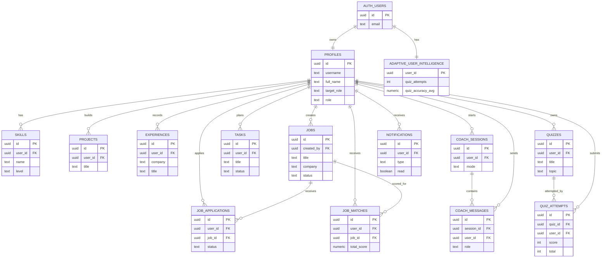

# Chakri AI Simple ER Diagram

This ERD intentionally includes only core tables that represent the main product flows.

- Identity and profile
- Portfolio/profile details
- Jobs and matching
- Coaching and quiz tracking
- Tasks and notifications

## Source Schema Files

- supabase_profile_schema.sql
- supabase_job_system_schema.sql
- supabase_tasks_schema.sql
- supabase_coach_schema.sql
- supabase_adaptive_intelligence_schema.sql
- supabase_notifications_schema.sql
